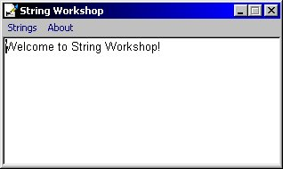



## String Workshop

### Description

This program was devised to help novices and learners encompass a better understanding of basic string manipulation. It uses such functions as Left, Mid, Right, Replace, etc. Also allows you to save and open text files with API.
 
### More Info
 

             |
---                |---
**Submitted On**   |2000-11-10 12:32:52
**By**             |[David Martinjak](https://github.com/Planet-Source-Code/PSCIndex/blob/master/ByAuthor/david-martinjak.md)
**Level**          |Beginner
**User Rating**    |4.0 (8 globes from 2 users)
**Compatibility**  |VB 6\.0
**Category**       |[String Manipulation](https://github.com/Planet-Source-Code/PSCIndex/blob/master/ByCategory/string-manipulation__1-5.md)
**World**          |[Visual Basic](https://github.com/Planet-Source-Code/PSCIndex/blob/master/ByWorld/visual-basic.md)
**Archive File**   |[CODE\_UPLOAD1155211102000\.zip](https://github.com/Planet-Source-Code/david-martinjak-string-workshop__1-12686/archive/master.zip)

### API Declarations

Located in General:(Declarations)

